# 🏗️ AI Math Tutor - System Architecture

*Behold, our mathematical fortress! Here's how all the pieces fit together to create an epic learning adventure.*

## Architecture Diagram

```mermaid
graph TB
    %% User Layer
    subgraph "👨‍🎓 Users"
        Student[Student<br/>8-18 years old]
        Teacher[Teacher<br/>Classroom demos]
        Parent[Parent<br/>Progress monitoring]
    end

    %% Frontend Layer
    subgraph "🎨 Frontend Layer (Nuxt 3 + Vercel)"
        Nuxt[Nuxt 3 App<br/>Vue 3 + Nuxt UI]
        subgraph "📱 Core Components"
            ChatUI[Chat Interface<br/>UChatBubble, UCard]
            UploadUI[File Upload<br/>UUpload component]
            SidebarUI[Sidebar<br/>USidebar for history]
            AuthUI[Auth Modal<br/>UModal, UButton]
        end
        subgraph "🎮 Gamification"
            XPDisplay[XP Counter<br/>Real-time updates<br/>1 XP ≈ 1 min]
            BadgeSys[Badge System<br/>Achievement unlocks]
            Animations[CSS Animations<br/>60fps transitions]
        end
        subgraph "🧠 Pedagogical Systems"
            KGVisualization[Knowledge Graph<br/>Topic hierarchy<br/>Progress visualization]
            MasteryTracking[Mastery Tracking<br/>Per-topic mastery<br/>Frontier calculation]
            SpacedRepetition[Spaced Repetition<br/>FIRe algorithm<br/>Review scheduling]
            DiagnosticUI[Diagnostic & Placement<br/>Frontier identification]
            QuizUI[Retrieval Practice<br/>Interleaved quizzes<br/>80-85% accuracy target]
        end
        subgraph "📐 Math Rendering"
            KaTeX[KaTeX Engine<br/>via UMarkdown]
        end
    end

    %% API Layer
    subgraph "🔧 API Layer (Supabase Edge Functions)"
        LLMProxy[LLM Proxy<br/>Edge Function]
        VisionAPI[Vision Processing<br/>OCR/Image parsing]
        PromptEngine[Socratic Prompts<br/>KG-aware context]
        KGApi[Knowledge Graph API<br/>Prerequisites, Frontier<br/>Topic queries]
        DiagnosticAPI[Diagnostic API<br/>Placement algorithm<br/>Frontier calculation]
        QuizAPI[Quiz Generation API<br/>Interleaved questions<br/>Accuracy targeting]
    end

    %% Data Layer
    subgraph "🗄️ Data Layer (Supabase)"
        subgraph "Authentication"
            Auth[Supabase Auth<br/>Email/Magic Link<br/>Anonymous fallback]
        end
        subgraph "Database"
            ChatDB[(Chat History<br/>Realtime enabled)]
            GameStateDB[(Gamestate<br/>XP, Badges, Progress)]
            UserProfiles[(User Profiles<br/>Optional persistence)]
            KnowledgeGraphDB[(Knowledge Graph<br/>Topics, Prerequisites<br/>Encompassings)]
            MasteryDB[(Mastery Tracking<br/>Per-topic mastery<br/>Frontier calculation)]
            DiagnosticDB[(Diagnostic Results<br/>Placement data)]
            QuizDB[(Quiz Sessions<br/>Retrieval practice)]
        end
        subgraph "Storage"
            FileStorage[(File Storage<br/>Image uploads)]
        end
    end

    %% External Services
    subgraph "🤖 AI Services"
        Grok[Grok LLM<br/>Primary: Fun, engaging<br/>Socratic responses]
        Fallback[Claude Sonnet<br/>Fallback for complex reasoning]
    end

    subgraph "🧪 Testing & Deployment"
        Playwright[Playwright E2E<br/>UI/UX testing]
        Vercel[Vercel<br/>Frontend deployment]
        SupabaseCloud[Supabase Cloud<br/>Backend hosting]
    end

    %% Data Flow
    Student --> Nuxt
    Teacher --> Nuxt
    Parent --> Nuxt

    Nuxt --> ChatUI
    Nuxt --> UploadUI
    Nuxt --> SidebarUI
    Nuxt --> AuthUI

    ChatUI --> XPDisplay
    ChatUI --> BadgeSys
    ChatUI --> Animations

    ChatUI --> KaTeX

    Nuxt --> LLMProxy
    UploadUI --> VisionAPI

    LLMProxy --> PromptEngine
    VisionAPI --> PromptEngine

    PromptEngine --> Grok
    PromptEngine --> Fallback

    Nuxt --> Auth
    Auth --> UserProfiles

    ChatUI --> ChatDB
    XPDisplay --> GameStateDB
    BadgeSys --> GameStateDB
    KGVisualization --> KnowledgeGraphDB
    MasteryTracking --> MasteryDB
    SpacedRepetition --> MasteryDB
    DiagnosticUI --> DiagnosticDB
    QuizUI --> QuizDB

    UploadUI --> FileStorage

    ChatDB -.-> ChatUI
    GameStateDB -.-> XPDisplay
    GameStateDB -.-> BadgeSys
    KnowledgeGraphDB -.-> KGVisualization
    MasteryDB -.-> MasteryTracking
    MasteryDB -.-> SpacedRepetition
    DiagnosticDB -.-> DiagnosticUI
    QuizDB -.-> QuizUI

    Nuxt --> KGApi
    Nuxt --> DiagnosticAPI
    Nuxt --> QuizAPI

    KGApi --> KnowledgeGraphDB
    DiagnosticAPI --> DiagnosticDB
    DiagnosticAPI --> KnowledgeGraphDB
    QuizAPI --> QuizDB
    QuizAPI --> KnowledgeGraphDB

    Playwright -.-> Nuxt
    Vercel -.-> Nuxt
    SupabaseCloud -.-> Auth
    SupabaseCloud -.-> ChatDB
    SupabaseCloud -.-> GameStateDB
    SupabaseCloud -.-> FileStorage

    %% Styling
    classDef frontend fill:#e1f5fe,stroke:#01579b,stroke-width:2px
    classDef data fill:#f3e5f5,stroke:#4a148c,stroke-width:2px
    classDef api fill:#fff3e0,stroke:#e65100,stroke-width:2px
    classDef external fill:#e8f5e8,stroke:#2e7d32,stroke-width:2px
    classDef user fill:#fce4ec,stroke:#880e4f,stroke-width:2px

    class Nuxt,ChatUI,UploadUI,SidebarUI,AuthUI,XPDisplay,BadgeSys,Animations,KaTeX,KGVisualization,MasteryTracking,SpacedRepetition,DiagnosticUI,QuizUI frontend
    class Auth,ChatDB,GameStateDB,UserProfiles,FileStorage,KnowledgeGraphDB,MasteryDB,DiagnosticDB,QuizDB data
    class LLMProxy,VisionAPI,PromptEngine,KGApi,DiagnosticAPI,QuizAPI api
    class Grok,Fallback,Playwright,Vercel,SupabaseCloud external
    class Student,Teacher,Parent user
```

## 🏛️ Architecture Overview

### 🎯 Core Principles
- **Mastery Learning**: 100% mastery before advancement; topic-level granularity
- **Knowledge Graph**: Prerequisite/encompassing relationships drive instruction
- **Knowledge Frontier**: Only serve lessons at student's frontier (boundary of knowledge)
- **Socratic Focus**: Never direct answers - guide through questions with KG awareness
- **Evidence-Based**: Research-backed pedagogy (spaced repetition, retrieval practice, micro-scaffolding)
- **Gamification Calibrated**: 1 XP ≈ 1 minute of focused work (research-backed standard)
- **MCP-Driven**: All components reference official docs for accuracy
- **Mobile-First**: Responsive design for all devices
- **Optional Auth**: Anonymous sessions with optional persistence for mastery tracking

### 🔄 Data Flow Patterns

#### User Input → AI Processing
1. **Problem Input**: Text or image uploaded via UUpload component
2. **Vision Processing**: Edge function processes image through LLM vision
3. **Parsing**: Extract mathematical content and context
4. **Chat Integration**: Display parsed problem in gamified chat interface

#### Conversational Flow (KG-Enhanced)
1. **Student Response**: Input through chat interface
2. **Context Assembly**: Combine with conversation history + gamestate + Knowledge Graph state (current topic, mastery levels, prerequisites)
3. **KG-Aware Processing**: Query Knowledge Graph for prerequisite gaps, mastery status, frontier position
4. **LLM Processing**: Grok generates Socratic response with KG context (topic, prerequisites, mastery level) and XP rewards
5. **Real-time Updates**: Supabase realtime pushes updates to UI (chat, mastery, reviews)
6. **Gamification**: XP/badges update with smooth animations (1 XP ≈ 1 minute)
7. **Mastery Validation**: Confirm 100% mastery before allowing topic advancement
8. **Remediation**: If lesson failed twice, assign prerequisite reviews via KG → consolidation break → re-attempt

#### Persistence Layer
1. **Anonymous Sessions**: Basic functionality without auth
2. **Optional Profiles**: Email/magic link for progress tracking (mastery, KG position, spaced repetition schedule)
3. **Realtime Sync**: Live updates across browser tabs (chat, mastery, reviews)
4. **Cross-Session**: Resume conversations and maintain progress (mastery state, knowledge frontier, review schedule)
5. **Knowledge Graph State**: Topic mastery, prerequisites mastered, encompassings, frontier position
6. **Spaced Repetition State**: Review schedules per topic, implicit repetition tracking, repetition compression

### 🛡️ Security & Performance

#### Security Measures
- **Supabase RLS**: Row Level Security on all data
- **Anonymous Auth**: No PII required for core functionality
- **API Key Protection**: Server-side LLM calls via Edge Functions
- **Input Validation**: Client and server-side validation

#### Performance Targets
- **<2s Response Time**: LLM calls optimized for speed
- **<2MB Bundle**: Tree-shaking and lazy loading
- **60fps Animations**: Hardware-accelerated CSS transitions
- **Mobile Optimized**: Progressive loading and caching

### 📊 Scalability Considerations

#### Current Scale
- **100 Concurrent Users**: Supabase handles basic load
- **Anonymous Sessions**: No user management overhead
- **Edge Functions**: Global CDN for low latency

#### Growth Path
- **Supabase Scaling**: Automatic scaling with usage
- **CDN Distribution**: Vercel global edge network
- **Caching Strategy**: Static assets + API response caching
- **Monitoring**: Built-in analytics and error tracking

### 🔧 Technology Choices Rationale

| Component | Choice | Why |
|-----------|--------|-----|
| **Frontend** | Nuxt 3 + Vue 3 | Full-stack Vue with SSR, excellent DX |
| **UI Library** | Nuxt UI | Consistent, accessible, MCP-documented |
| **Backend** | Supabase | Auth, DB, Storage, Realtime in one platform |
| **Knowledge Graph** | Custom (Postgres) | Topic hierarchy, prerequisites, encompassings via SQL |
| **Mastery System** | Custom (Supabase) | Topic-level mastery tracking, frontier calculation |
| **Spaced Repetition** | Custom FIRe | Fractional Implicit Repetition algorithm |
| **LLM** | Grok | Kid-friendly personality, engaging KG-aware responses |
| **Math Rendering** | KaTeX | Fast, client-side LaTeX rendering |
| **Deployment** | Vercel | Nuxt-optimized, global CDN |
| **Testing** | Playwright | E2E testing for complex user flows |

### 🚀 Deployment Architecture

*This architecture gives us a solid foundation for rapid development while ensuring scalability, security, and that magical gamified learning experience! 🎮✨*
